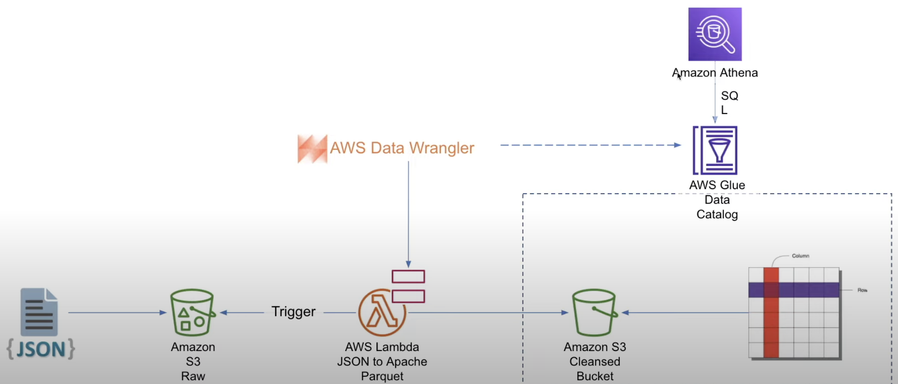

# AWS based Bigdata project using YouTube Analysis dataset

## Overview

This project aims to securely manage, streamline, and perform analysis on the structured and semi-structured YouTube videos data based on the video categories and the trending metrics.

## Project Goals
1. Data Ingestion — Build a mechanism to ingest data from different sources
2. ETL System — We are getting data in raw format, transforming this data into the proper format
3. Data lake — We will be getting data from multiple sources so we need centralized repo to store them
4. Scalability — As the size of our data increases, we need to make sure our system scales with it
5. Cloud — We can’t process vast amounts of data on our local computer so we need to use the cloud, in this case, we will use AWS
6. Reporting — Build a dashboard to get answers to the question we asked earlier

## Services we will be using
1. Amazon S3: Amazon S3 is an object storage service that provides manufacturing scalability, data availability, security, and performance.
2. AWS IAM: This is nothing but identity and access management which enables us to manage access to AWS services and resources securely.
3. QuickSight: Amazon QuickSight is a scalable, serverless, embeddable, machine learning-powered business intelligence (BI) service built for the cloud.
4. AWS Glue: A serverless data integration service that makes it easy to discover, prepare, and combine data for analytics, machine learning, and application development.
5. AWS Lambda: Lambda is a computing service that allows programmers to run code without creating or managing servers.
6. AWS Athena: Athena is an interactive query service for S3 in which there is no need to load data it stays in S3.

## Dataset Used
This Kaggle dataset contains statistics (CSV files) on daily popular YouTube videos over the course of many months. There are up to 200 trending videos published every day for many locations. The data for each region is in its own file. The video title, channel title, publication time, tags, views, likes and dislikes, description, and comment count are among the items included in the data. A category_id field, which differs by area, is also included in the JSON file linked to the region.

https://www.kaggle.com/datasets/datasnaek/youtube-new

## Transformation of Raw to Cleaned data flow diagram

Cleaned Data from Raw Data using AWS Lambda

### Steps:

1. Setup AWS Lambda: Create a function with Python 3.8 runtime and set an execution role for S3 access.
2. ETL Code: Utilize AWS Wrangler for S3 access and pandas for data processing. Normalize data and save in Parquet format.
3. Environment Variables: Store output location, catalog name, table name, and data write operation.
4. Test Function: Use an S3 put event and provide the bucket name and file for testing.
5. Error Handling: Add necessary Lambda layers for missing packages and adjust timeout if needed.
6. AWS Glue Integration: Create a catalog and table for cleaned data.
7. Query with AWS Athena: Convert JSON data to a structured tabular form.
Automation: Automate the conversion of raw data to the clean version.

### Challenges:

1. Handling missing packages in Lambda.
2. Addressing Lambda's timeout limits.
3. Ensuring correct permissions for data access.
4. Normalizing diverse raw data formats.
5. Handling potential errors during testing.
6. Managing data size limitations of Lambda.
7. Ensuring high data quality during cleaning.

Note: This project transforms raw data into cleaned, structured data using AWS services. Suitable for further analysis and visualization.

## Overall Architecture Diagram

